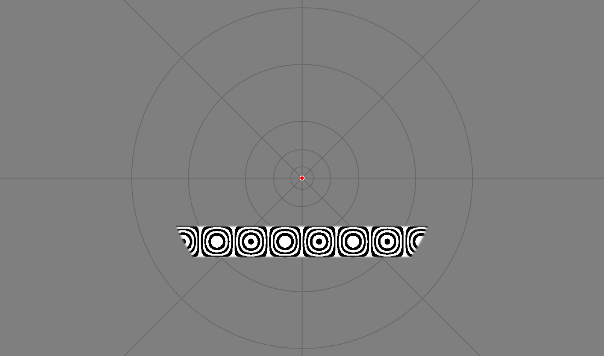

# motion_dependent_pRF
Package for presenting stimuli for pRF mapping using Psychopy.

The stimuli in this package are targeted to achieve optimal stimulation in area hMT.
If classical pRF stimuli (flickering checkerboards in bar apertures) are desired please check out this related project:
https://github.com/ingo-m/pyprf

## Dependencies
[**Python 2.7**](https://www.python.org/download/releases/2.7/)

| Package                              | Tested version |
|--------------------------------------|----------------|
| [NumPy](http://www.numpy.org/)       | 1.11.1         |
| [SciPy](http://www.scipy.org/)       | 0.18.0         |
| [Psychopy](http://www.psychopy.org/) | 1.83.0         |

## How to use

This package includes three different stimulus sets, depending on desired purpose.
The sets are organized into three different folders: MotLoc, MotDepPrf, PsychoPhysics

1. MotLoc: Stimulation script to map visual areas (especially area hMT) using the pRF framework.

2. MotDepPrf: Stimulation script to measure shift in pRFs underlying motion-induced position shifts.

3. PsychoPhysics: Stimulation script for psychophysical experiment to determine perceptual motion-induced position shifts.

For each of these three sets the procedure for generating stimuli is similar:

1. Specify your desired parameters in the respective config file.

2. Run the createTexMasks file to generate relevant masks and textures.
Masks and textures will be saved as numpy arrays in .npz format in the parent folder called MaskTextures.

3. Run the respective createCond file to generate the condition order.
Condition and target presentation orders will be saved as numpy arrays in .npz format in the parent folder called Conditions.

4. Run the respective stimulus presentation file (motLoc.py, motDepPrf.py, motDepPrf_psyphy) in PsychoPy.

## References
This application is based on the following work:

* van Dijk, J. A., de Haas, B., Moutsiana, C., & Schwarzkopf, D. S. (2016). Intersession reliability of population receptive field estimates. NeuroImage, 143, 293–303. https://doi.org/10.1016/j.neuroimage.2016.09.013

* Amano, K., Wandell, B. A., & Dumoulin, S. O. (2009). Visual field maps, population receptive field sizes, and visual field coverage in the human MT+ complex. Journal of Neurophysiology, 102(5), 2704–18. https://doi.org/10.1152/jn.00102.2009

* Kolster, H., Peeters, R., & Orban, G. a. (2010). The retinotopic organization of the human middle temporal area MT/V5 and its cortical neighbors. The Journal of Neuroscience : The Official Journal of the Society for Neuroscience, 30(29), 9801–20. https://doi.org/10.1523/JNEUROSCI.2069-10.2010

## License

The project is licensed under [GNU General Public License Version 3](http://www.gnu.org/licenses/gpl.html).
